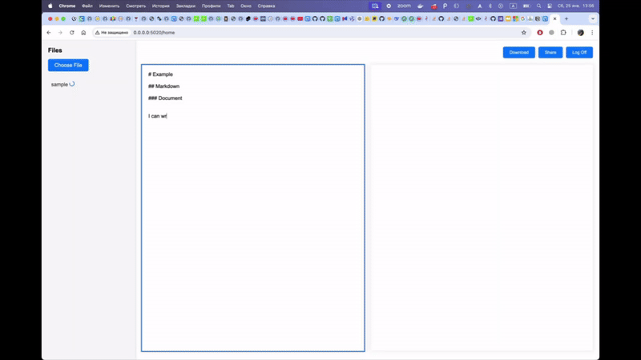
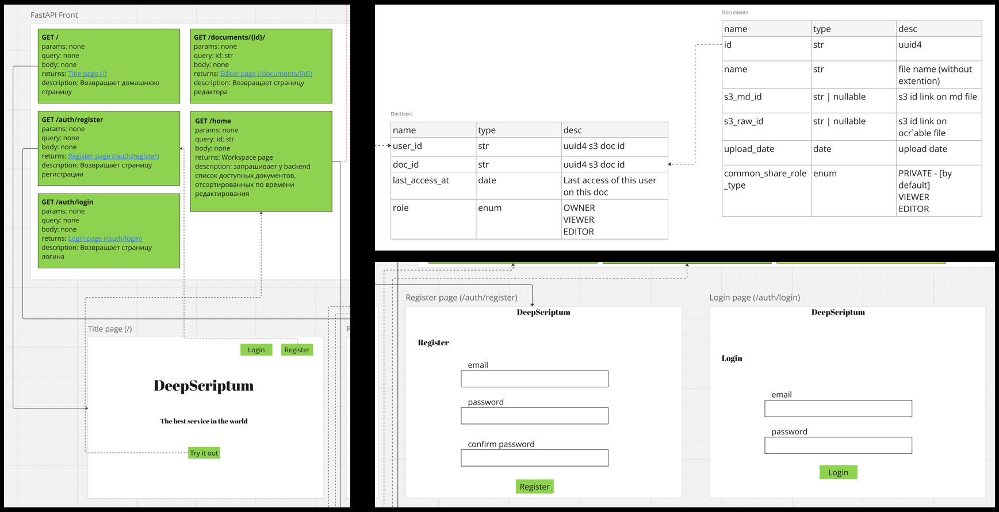

<!-- PROJECT LOGO -->
 

<h3 align="center">DeepScriptum</h3>

  

    Convert any file into it's MarkDown source
     
  

<!-- TABLE OF CONTENTS -->

  
Table of Contents

  <ol>
    <li>
      <a href="#current-state-and-updates">Current state and updates</a>
    </li>
    <li>
      <a href="#about-the-project">About The Project</a>
      <ul>
        <li><a href="#built-with">Built With</a></li>
      </ul>
    </li>
    <li>
      <a href="#getting-started">Getting Started</a>
      <ul>
        <li><a href="#installation">Installation</a></li>
      </ul>
    </li>
    <li><a href="#acknowledgments">Acknowledgments</a></li>
  </ol>

<!-- UPDATES -->
## Current state and updates

This branch contains demo DeepScriptum implementation and map-reduce approach to perfom OCR in parallel. 
Service provides fast transformation of any file to .md
The program allows you to quickly transform files
Easy to use interface

### December 2024:
Implementation with GPT-4o. Includes FastAPI backend (Celery used for task managing), PostgreSQL and HTML/CSS frontend.

### October 2024:
Deep dive into OCR, understanding how it work and how to use it for the project.

<!-- ABOUT THE PROJECT -->
## About The Project

DeepScriptum is an advanced project designed to seamlessly convert any type of document into Markdown (.md) format. Utilizing cutting-edge AI technology, it ensures accurate and efficient translation while preserving the original structure and content. Ideal for developers, writers, and businesses, DeepScriptum streamlines documentation processes and enhances collaboration.

(<a href="#top">back to top</a>)

<!-- GETTING STARTED -->

## Architecture

### Installation

1) Git clone or download
2) Create .env file in root due to `.env.example`
3) `sudo docker-compose build && sudo docker-compose up`

Congrats! You can access your service on `localhost`

(<a href="#top">back to top</a>)

### Built With

* [PostgreSQL](https://www.postgresql.org/)
* [RabbitMQ](https://www.rabbitmq.com/)
* [FastAPI](https://fastapi.tiangolo.com/)
* [Celery](https://github.com/celery/celery)
* [OpenAI GPT](https://openai.com/)

(<a href="#top">back to top</a>)

<!-- CONTACT -->
## Authors

- <a href="https://www.linkedin.com/in/pavviaz/">Vyaznikov Pavel</a>
- <a href="https://t.me/nikuto11">Busko Nikita</a>
- <a href="https://t.me/helilozium">Rychkov Pavel</a>
- <a href="https://t.me/oran9e_lime">Orlova Angelina</a>

(<a href="#top">back to top</a>)

